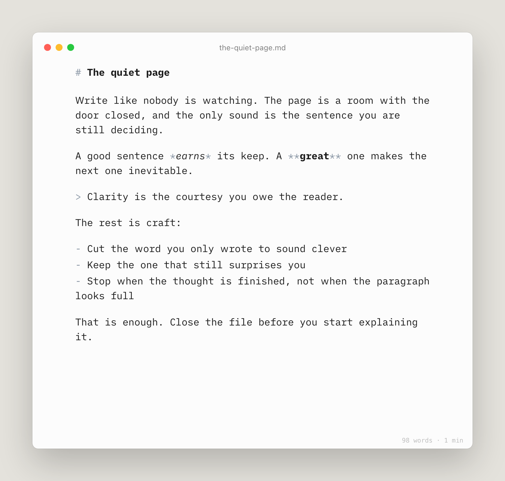
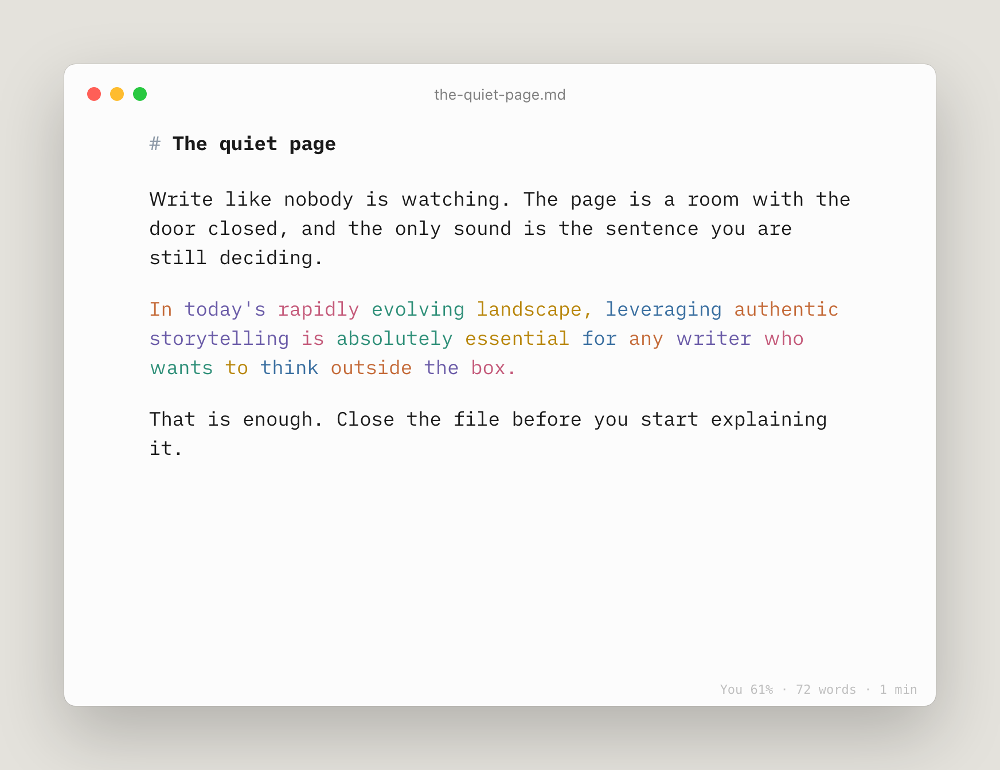
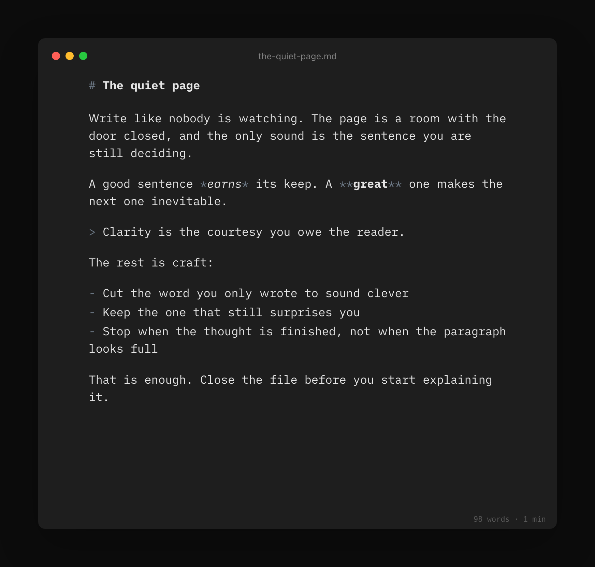
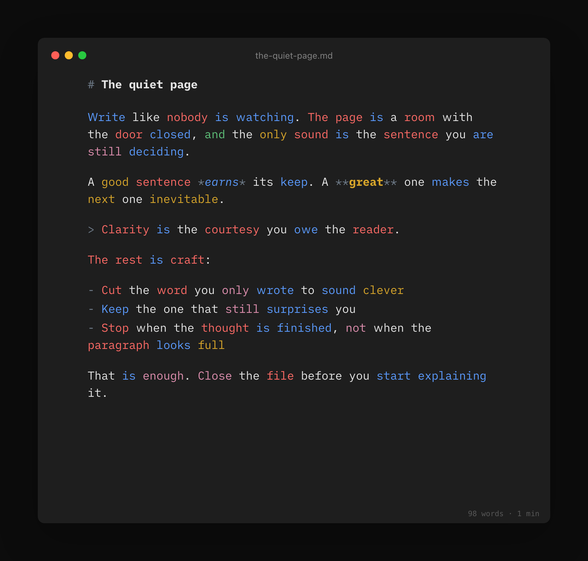
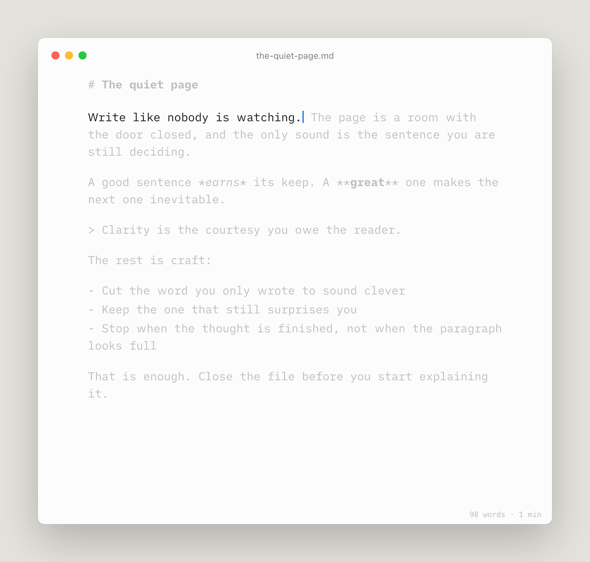
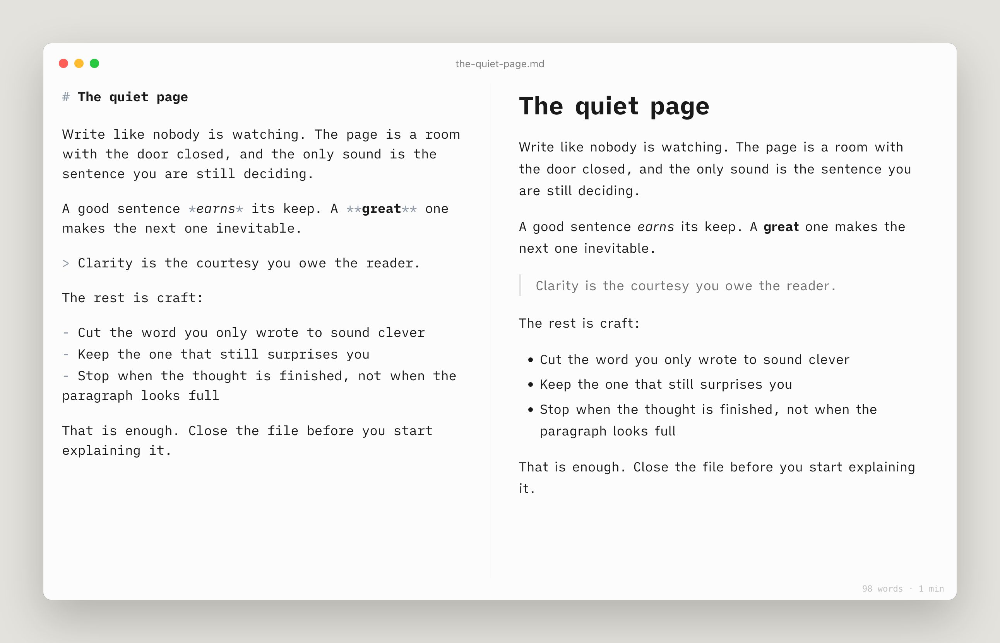
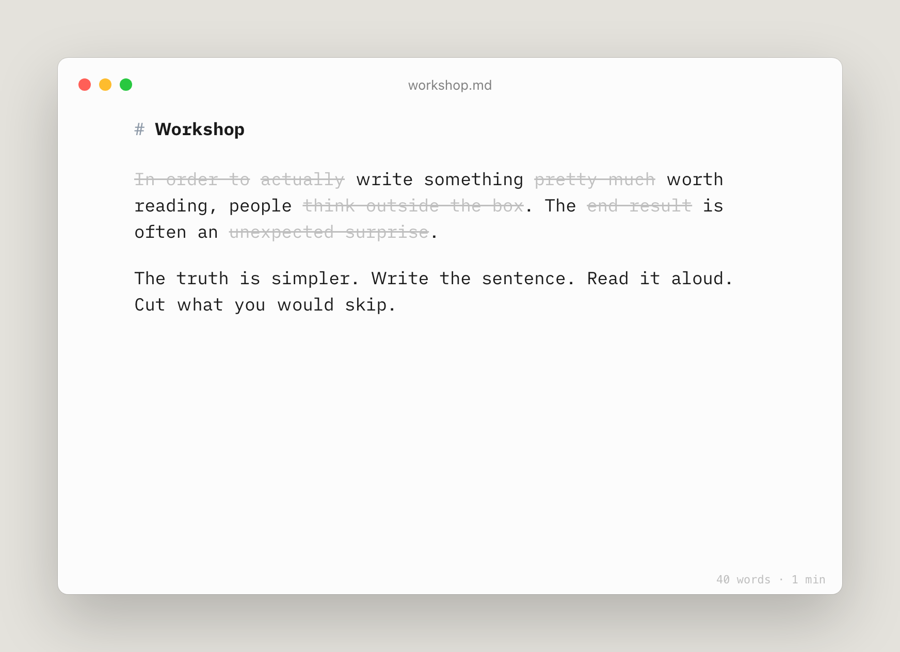
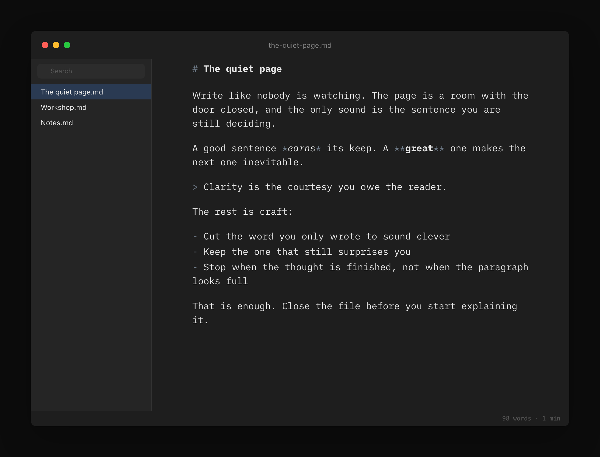

<p align="center">
  
</p>

# Writer

A simple place with no AI. If there is any, you know.

Authentic thoughts. Yours.

Native Swift and AppKit. No Xcode project.

<p align="center">
  
</p>

Authorship, ⇧⌘A. What you typed stays black. What was pasted or generated is in color. Rewrite it and it becomes yours again.

<p align="center">
  
</p>

## Run it

macOS 14 or later, and Xcode 16 at `/Applications/Xcode.app`. The Makefile points `DEVELOPER_DIR` at that copy because the Command Line Tools SwiftPM on this machine cannot link package manifests.

```sh
git clone https://github.com/PiemonteF/writer.git
cd writer
make run
```

That builds `build/Writer.app` and opens it. Other targets:

```sh
make app       # build only
make install   # copy to /Applications and open
make test      # pure-function tests
```

Open any `.md`, `.markdown`, or `.txt` file, or start typing in the untitled window.

## What it looks like

Night Mode, ⌥⌘N.



Syntax Highlight, ⇧⌘D. Nouns red, verbs blue, adjectives brown, adverbs magenta, conjunctions green.



Focus Mode, ⌘D. The current sentence stays, the rest recedes.



Preview, ⌘R. Markdown on the left, HTML on the right.



Style Check, ⌥⇧⌘D. Fillers, clichés, and redundancies are struck in the editor only. Double-click a struck phrase to select it.



Library, ⌥⌘L. A folder of Markdown and text files, with search. File > Choose Library Folder. Default is `~/Documents/Writer`.



## Live editing and navigation

Under **Writer > Settings**, enable **Live Markdown Preview** (⌥⌘R) or
**Heading Tree** (⌥⌘O). Both are off by default and remembered across launches.

Live preview formats headings, emphasis, links, lists, quotes, code and dividers
inside the editor. The paragraph being edited reveals its Markdown markers;
other paragraphs hide them. The document and clipboard still contain plain
Markdown. Backspace on a divider, or immediately after its newline, deletes the
whole divider in one undoable edit. Code blocks have rounded containers; their
fence rows collapse to thin padding and reveal the backticks when edited. Quote
blocks use an indented, muted style with a left border. The separate HTML Preview remains available
for the complete rendered document, including images and tables.

The heading tree sits at the upper right, follows `#`, `##` and `###` headings,
and excludes fenced code. Its rounded container fades smoothly until hovered,
highlights the section at the top of the viewport, and lets you click a heading
to navigate. Heading links show a pointing-hand cursor. Reduced Motion disables
the fade animation.

Choose any installed font family from **View > Font > System fonts**.
Select Duo, Quattro or Mono to return to a bundled font.

## Automated builds

Every push to `main` tests and builds a universal macOS app (Apple Silicon and
Intel), then publishes `Writer-macOS.zip` as an asset on a new **Release**.
Open the repository's **Releases** section and download the ZIP from the latest
release's **Assets** list. Each release points to the exact commit that built it;
reruns create a separate release.

The ZIP is also published to **Packages** at `ghcr.io/piemontef/writer`, tagged
with the commit SHA and `latest`, and to the workflow's **Artifacts** section.
Pull requests build and test without publishing releases or packages.

GitHub Packages stores the ZIP as an OCI artifact; download with
[ORAS](https://oras.land/docs/commands/oras_pull/):

```sh
oras pull ghcr.io/piemontef/writer:latest
unzip Writer-macOS.zip
open Writer.app
```

Forks publish under their own lowercase owner/repository path. GitHub creates
packages as private by default; maintainers can change package visibility in
GitHub's package settings. Private downloads require `oras login ghcr.io` with
package read access. Builds use only an ad-hoc signature, with no Apple developer
certificate or notarization.

## What it does

- Centered column, dimmed markup, bold headings, italic emphasis, monospaced code. Fonts are iA Writer Duo, Quattro, and Mono, bundled, SIL OFL.
- Typewriter Mode (⌥⌘T) keeps the caret line centered.
- Authorship (⇧⌘A). Paste as / Mark as live under Authors.
- Word count and reading time (⇧⌘C toggles the bar).
- Export to HTML or PDF. Copy HTML with ⌥⌘C.
- Format: Bold ⌘B, Italic ⌘I, Heading 1 to 3 (⌥⌘1 to ⌥⌘3), Body ⌥⌘0.
- Standard document behavior: autosave, versions, Open Recent, rename, duplicate, find (⌘F), spelling.

## Shortcuts

| Action | Key |
| --- | --- |
| Focus Mode | ⌘D |
| Preview | ⌘R |
| Live Markdown Preview | ⌥⌘R |
| Heading Tree | ⌥⌘O |
| Night Mode | ⌥⌘N |
| Typewriter Mode | ⌥⌘T |
| Library | ⌥⌘L |
| Syntax Highlight | ⇧⌘D |
| Style Check | ⌥⇧⌘D |
| Authorship | ⇧⌘A |
| Word Count | ⇧⌘C |
| Copy HTML | ⌥⌘C |

## Layout

See `docs/DESIGN.md`.
